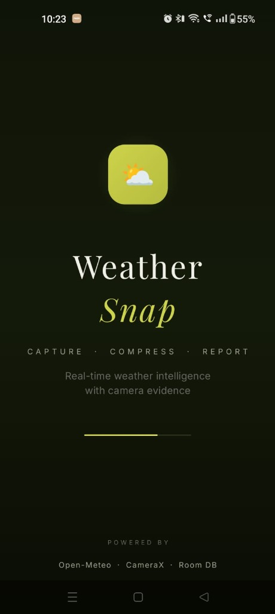
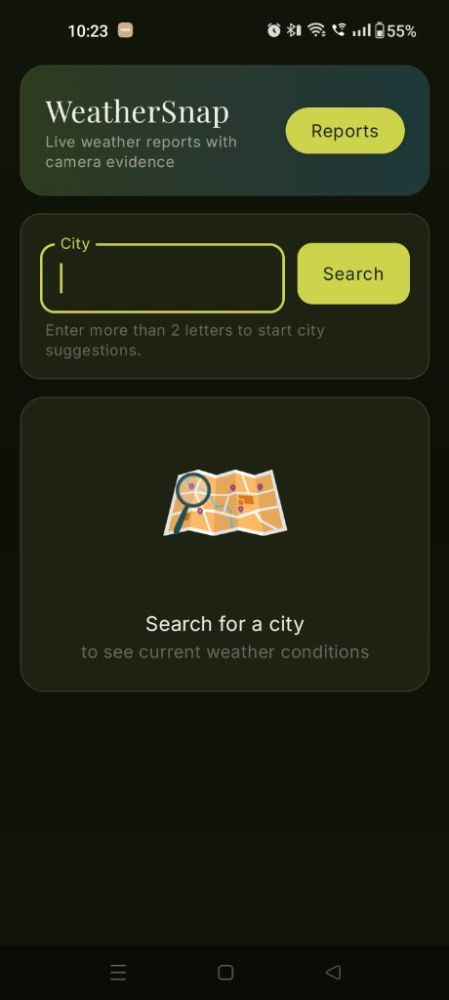
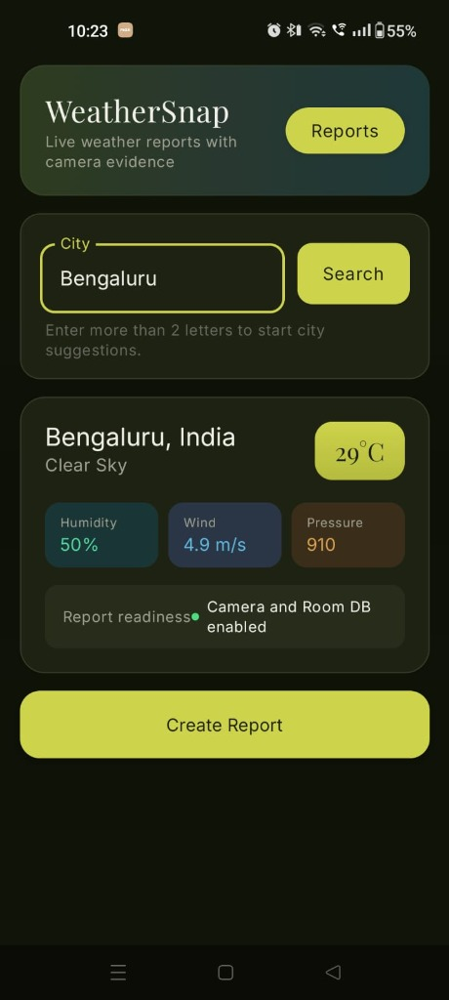
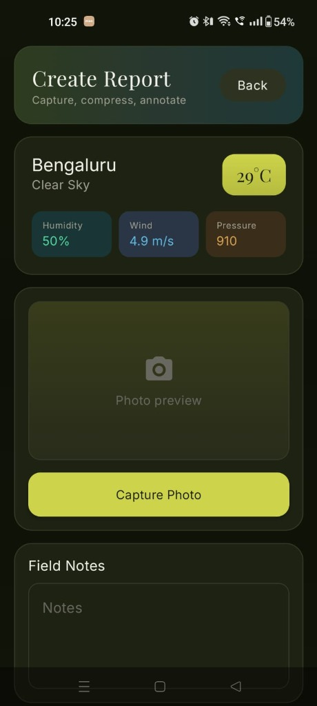
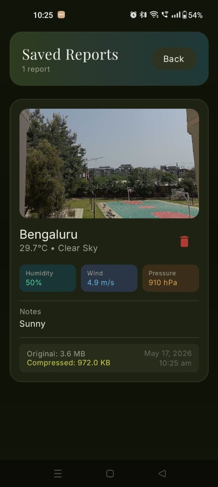

<div align="center">

# ⛅ WeatherSnap

**Real-time weather intelligence with camera evidence**

[](https://kotlinlang.org)
[](https://developer.android.com/jetpack/compose)
[](https://developer.android.com/topic/architecture)
[](https://open-meteo.com)

*Capture · Compress · Report*

---

**WeatherSnap** is a premium Android application that combines real-time weather data with on-device camera capture to generate comprehensive, evidence-backed weather reports. Built with modern Android development practices and a CRED-inspired editorial design language.

</div>

---

## 📸 Screenshots

<div align="center">
<table>
<tr>
<td align="center"><b>Splash Screen</b></td>
<td align="center"><b>Dashboard</b></td>
<td align="center"><b>Weather Data</b></td>
<td align="center"><b>Create Report</b></td>
<td align="center"><b>Saved Reports</b></td>
</tr>
<tr>
<td></td>
<td></td>
<td></td>
<td></td>
<td></td>
</tr>
</table>
</div>

---

## ✨ Key Features

<table>
<tr>
<td width="50%">

### 🌦️ Live Weather Dashboard
- Real-time data from **Open-Meteo API**
- City search with geocoding suggestions
- Temperature, humidity, wind speed & pressure
- Weather condition mapping with descriptive labels
- Lottie-animated empty state

</td>
<td width="50%">

### 📸 Camera Evidence System
- Custom **CameraX** integration
- Full-screen viewfinder with capture controls
- Runtime permission handling with graceful fallback
- On-device **JPEG compression** with size tracking
- Original vs. compressed size comparison

</td>
</tr>
<tr>
<td width="50%">

### 📋 Weather Reports
- Annotate captures with field notes
- Persist reports with **Room Database**
- View saved reports with full metadata
- Delete reports with confirmation dialog
- Reactive UI updates via Kotlin Flow

</td>
<td width="50%">

### 🎨 Premium UI/UX
- **Playfair Display** + **Inter** font pairing
- Dark olive theme with gradient headers
- Spring-physics animations throughout
- CRED-inspired splash screen
- Custom animated weather loader

</td>
</tr>
</table>

---

## 🏗️ Architecture

WeatherSnap follows **Clean Architecture** with the **MVVM** pattern, ensuring separation of concerns and testability.

```
app/
├── data/
│   ├── local/              # Room Database (DAO, Entity, Database)
│   └── remote/             # Retrofit API Services & DTOs
├── di/                     # Hilt Dependency Injection Modules
├── domain/
│   └── repository/         # Repository Interface & Implementation
├── ui/
│   ├── navigation/         # Compose Navigation (NavHost, Screen routes)
│   ├── screens/            # Composable Screens (5 screens)
│   ├── theme/              # Custom Theme, Colors, Typography
│   └── viewmodels/         # ViewModel with StateFlow
├── util/                   # Weather Code Mapper utility
├── MainActivity.kt         # Single Activity entry point
└── WeatherSnapApplication.kt  # Hilt Application class
```

### Data Flow

```
┌─────────────┐     ┌──────────────┐     ┌─────────────────┐
│   Compose    │◄───►│  ViewModel   │◄───►│   Repository    │
│   Screens    │     │  (StateFlow) │     │  (Single Source) │
└─────────────┘     └──────────────┘     └────────┬────────┘
                                                   │
                                         ┌─────────┴─────────┐
                                         │                    │
                                    ┌────▼────┐         ┌────▼────┐
                                    │  Remote  │         │  Local   │
                                    │ Retrofit │         │   Room   │
                                    └─────────┘         └─────────┘
```

---

## 🛠️ Tech Stack

| Layer | Technology | Purpose |
|-------|-----------|---------|
| **UI** | Jetpack Compose + Material 3 | Declarative UI with dynamic theming |
| **Navigation** | Navigation Compose | Type-safe screen routing |
| **DI** | Hilt (Dagger) | Constructor injection across all layers |
| **Networking** | Retrofit 2 + Gson | REST API consumption |
| **Persistence** | Room Database | Local report storage with Flow |
| **Camera** | CameraX | Image capture with lifecycle awareness |
| **Animations** | Lottie Compose | Rich JSON-based animations |
| **Fonts** | Playfair Display + Inter | Premium editorial typography |
| **Build** | Gradle Version Catalog | Centralized dependency management |
| **Processing** | KSP | Annotation processing for Room & Hilt |

---

## 🎨 Design Language

WeatherSnap uses a **dark olive military-green** aesthetic inspired by premium fintech applications:

```
Background:  #111408 → #0D1006     (deep dark olive)
Cards:       #1E2213 → #282C1A     (elevated surfaces)
Accent:      #CDD34A               (olive-yellow primary)
Borders:     #363A26               (subtle card outlines)
```

### Typography System

| Role | Font | Style |
|------|------|-------|
| Headlines | **Playfair Display** | Editorial serif — bold, impactful |
| Body Text | **Inter** | Clean sans-serif — highly readable |
| Splash Title | **Playfair Display Italic** | Accent color, editorial emphasis |

### Animated Elements
- 🌤️ **Weather Loader** — floating cloud with pulsing olive dots
- 🗺️ **Lottie Search** — animated map search on empty state
- ⛅ **Splash Screen** — phased spring animations with breathing glow
- 📋 **Report Cards** — staggered slide-in with fade animations

---

## 📱 Screens

| Screen | Description |
|--------|-------------|
| **Splash** | CRED-style animated intro with Playfair Display branding, breathing glow, and gradient loading bar |
| **Weather Dashboard** | City search with geocoding, live weather data display with colored detail chips |
| **Create Report** | Weather snapshot card, CameraX photo capture, image compression stats, field notes |
| **Camera** | Full-screen CameraX viewfinder with runtime permission handling |
| **Saved Reports** | Persistent report history with photo preview, metadata, and delete functionality |

---

## 🔧 Developer Decisions

### Image Compression Strategy
Photos captured via CameraX are compressed on-device before storage. The app tracks both original and compressed file sizes, displaying the compression ratio to demonstrate efficient storage management.

### State Persistence
`SavedStateHandle` is used in the ViewModel to survive process death. Draft reports, search queries, and weather states are preserved across configuration changes.

### Reactive Data Layer
Room's `Flow<List<ReportEntity>>` provides reactive updates — when a report is saved or deleted, the UI automatically reflects the change without manual refresh.

### In-Memory Caching
City search results are cached in-memory to reduce redundant API calls for repeated queries, improving responsiveness and reducing network usage.

---

## 🚀 Getting Started

### Prerequisites
- Android Studio Ladybug or newer
- JDK 17+
- Android device or emulator (API 26+)

### Build & Run

```bash
# Clone the repository
git clone https://github.com/zohaib-md/WeatherSnap.git

# Open in Android Studio and sync Gradle
# Or build from command line:
./gradlew assembleDebug

# Install on connected device
./gradlew installDebug
```

> **Note:** No API keys required — WeatherSnap uses the free [Open-Meteo API](https://open-meteo.com/) which doesn't require authentication.

---

## 📦 Dependencies

All dependencies are managed via **Gradle Version Catalog** (`libs.versions.toml`):

```toml
kotlin       = "2.2.0"
compose-bom  = "2025.05.00"
hilt         = "2.59.2"
room         = "2.7.1"
camerax      = "1.5.0"
retrofit     = "2.11.0"
lottie       = "6.6.4"
```

---

## 📄 License

This project is built as part of an internship assessment.

---

<div align="center">

**Built with ❤️ using Kotlin & Jetpack Compose**

*WeatherSnap — Where weather meets evidence*

</div>
